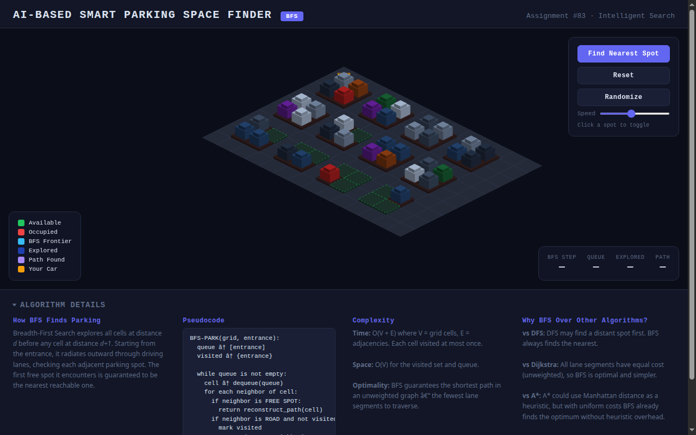
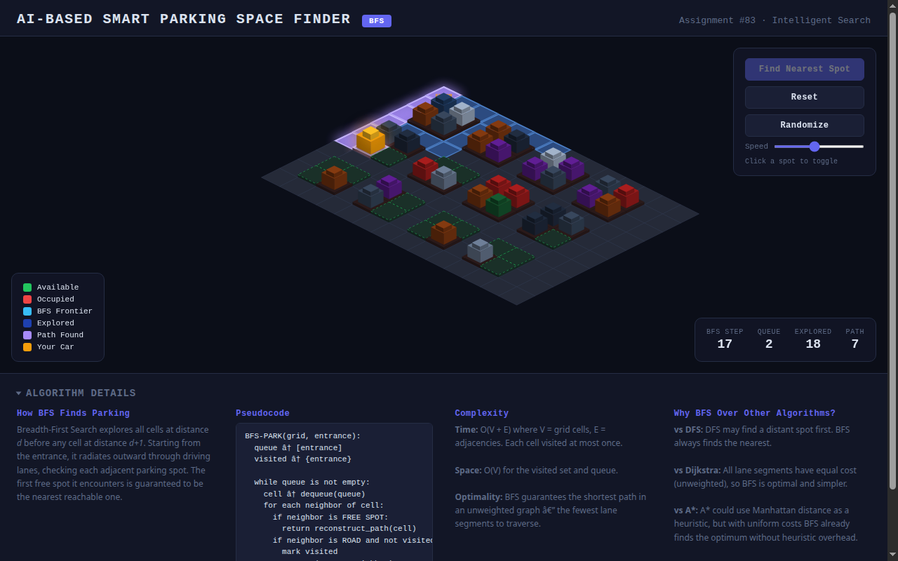
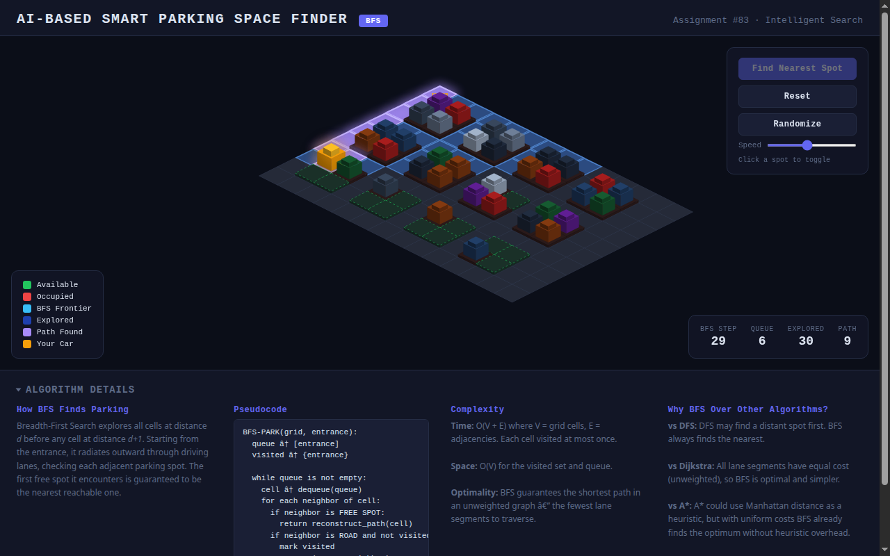

# AI-Based Smart Parking Space Finder

**Assignment #83** | Algorithm: BFS (Breadth-First Search) | Category: Intelligent Search | Difficulty: Easy

## Problem Statement

Design an AI-based system that helps drivers find the nearest available parking spot in a parking lot. The system should efficiently search through the parking lot layout and guide the vehicle along the shortest path to the closest free space.

## Solution Approach

This project implements a **Breadth-First Search (BFS)** algorithm to solve the smart parking problem. BFS is ideal here because it guarantees finding the nearest available parking spot by exploring all cells at distance *d* before any cell at distance *d+1*.

### How It Works

1. **Grid Representation**: The parking lot is modeled as a 14x10 grid where each cell is either a driving lane (road), a free parking spot, or an occupied parking spot.

2. **BFS Exploration**: Starting from the entrance, the algorithm explores adjacent road cells level by level, checking each neighboring parking spot for availability.

3. **Path Reconstruction**: Once the nearest free spot is found, the algorithm backtracks through parent pointers to reconstruct the shortest driving path from the entrance to the target spot.

4. **Optimality Guarantee**: BFS guarantees the shortest path in an unweighted graph. Since all lane segments have equal traversal cost, the first free spot discovered is provably the nearest reachable one.

### Algorithm

```
BFS-PARK(grid, entrance):
    queue <- [entrance]
    visited <- {entrance}

    while queue is not empty:
        cell <- dequeue(queue)
        for each neighbor of cell:
            if neighbor is FREE SPOT:
                return reconstruct_path(cell)
            if neighbor is ROAD and not visited:
                mark visited
                enqueue(queue, neighbor)

    return "No spots available"
```

### Complexity

| Metric | Value |
|--------|-------|
| **Time** | O(V + E) where V = grid cells, E = adjacencies |
| **Space** | O(V) for the visited set and BFS queue |
| **Optimality** | Guaranteed shortest path (unweighted graph) |

### Why BFS Over Other Algorithms?

| Algorithm | Comparison |
|-----------|-----------|
| **DFS** | May find a distant spot first; does not guarantee shortest path |
| **Dijkstra** | All lane segments have equal cost, so BFS is optimal and simpler |
| **A*** | Could use Manhattan distance heuristic, but with uniform costs BFS already finds the optimum without heuristic overhead |

## 3D Interactive Demo

The project includes a fully interactive **3D isometric visualization** built with HTML5 Canvas:

- **Isometric 3D rendering** with extruded car blocks, curb heights, and shadow effects
- **Animated BFS search** showing the exploration wave cell-by-cell with glowing blue overlays
- **Car pathing animation** — the vehicle drives along the discovered shortest path
- **Live statistics panel** — BFS step count, queue size, explored cells, and path length update in real-time
- **Interactive controls** — click spots to toggle occupied/free, randomize the layout, adjust animation speed

### Features

- Click any parking spot to toggle between occupied and free
- **Find Nearest Spot** — starts BFS search animation from the entrance
- **Randomize** — generates a new random parking lot layout
- **Speed slider** — controls the animation playback speed
- **Algorithm Details** — expandable section with pseudocode and complexity analysis

## Output

### 1. Initial Parking Lot

The 3D isometric parking lot with occupied spots (cars) and available spots (green dashed outlines). Spots near the entrance are more heavily occupied, simulating realistic parking patterns.



### 2. BFS Search in Progress

The BFS algorithm exploring the lot — blue overlay shows explored road cells, the bright cyan cell is the current frontier being examined. The yellow car waits at the entrance while the algorithm searches. Stats panel shows real-time metrics.



### 3. Path Found and Car Parked

After exploring 30 cells, BFS found the nearest available spot. The blue overlay shows all explored cells. The car navigated a 9-cell path from the entrance to the nearest free parking space.



## How to Run

1. Open `parking.html` in any modern web browser
2. Click **Find Nearest Spot** to start the BFS search
3. Watch the algorithm explore the lot and guide the car to the nearest spot

Or serve locally:

```bash
python3 -m http.server 8080
# Open http://localhost:8080/parking.html
```

## Tech Stack

- **HTML5 Canvas** — isometric 3D rendering engine
- **Vanilla JavaScript** — BFS algorithm, animation system, UI controls
- **CSS** — dark/light theme support, glass-morphism panels

## Project Structure

```
.
├── README.md              # Project documentation
├── parking.html           # Complete self-contained application
└── images/
    ├── 01_initial.png         # Screenshot: initial parking lot
    ├── 02_bfs_searching.png   # Screenshot: BFS search in progress
    └── 03_parked.png          # Screenshot: car parked at nearest spot
```
